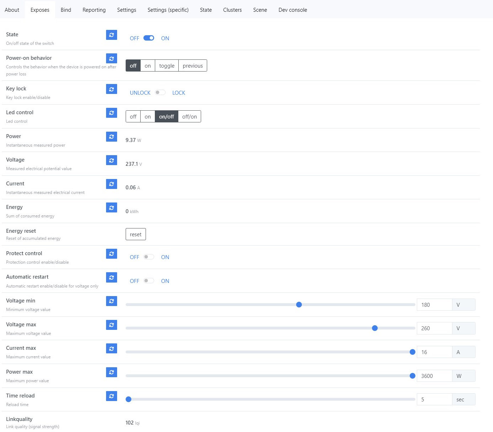
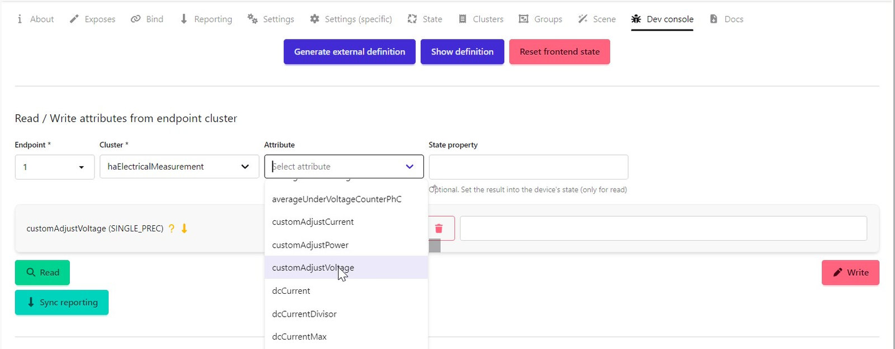
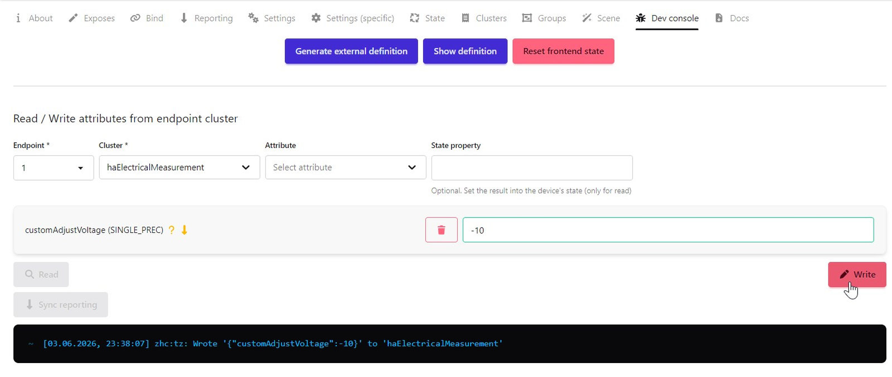
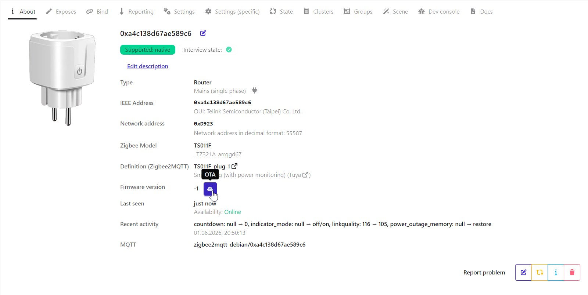
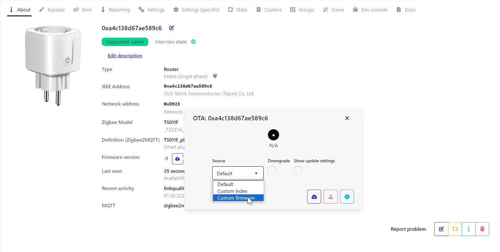
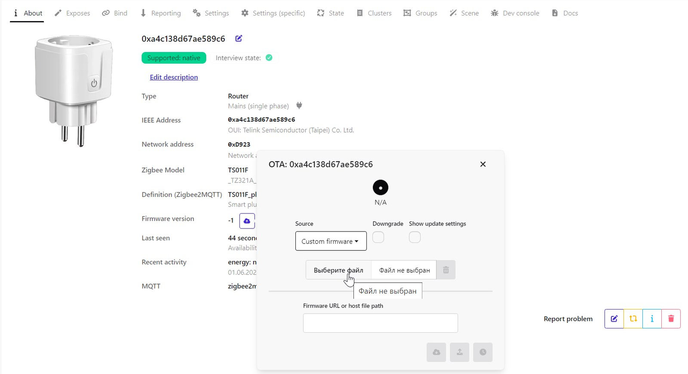
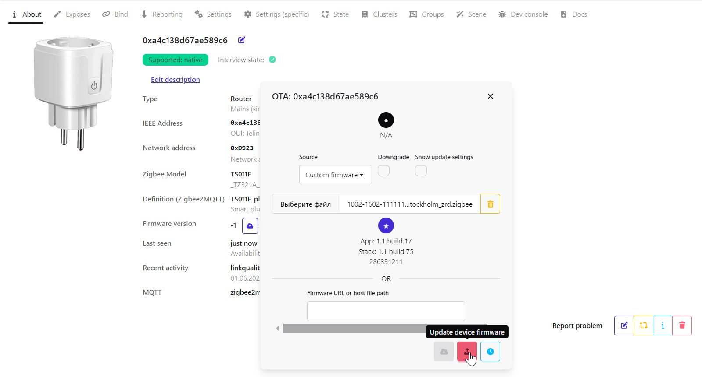
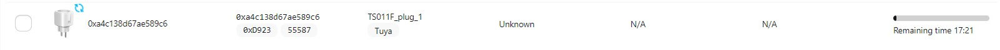

# <a id="Top">EKF Socket with power monitoring with custom firmware</a>

### Custom firmware for EKF Socket models

- TS011F _TZ321A_arrqgd67

**Автор не несет никакой ответственности, если вы, воспользовавшись этим проектом, превратите свою умную розетку в полоумную.**

## Возмножности

- `State` - выводит текущее состояние розетки.
- `Power-on behavior` - настраивает в какой режим переходит розетка при подаче питания.
- `Key lock` - блокирует кнопку на корпусе устройства. **Включить/выключить блокировку можно только удаленно!**
- `Led control` - управление работой светодиода.
	- `off` - всегда выключен.
	- `on` - всегда включен.
	- `on/off` - включен, когда розетка включена, выключен, когда розетка отключена.
	- `off/on` - выключен, когда розетка включена, включен, когда розетка отключена.
- `Power` - выводит текущее значение мощности.
- `Voltage` - выводит текущее значение напряжения.
- `Current` - выводит текущее значение силы тока.
- `Energy` - выводит текущее значение накопленной энергии.
- `Energy reset` - сбросить на 0 текущее значение накопленной энергии.
- `Protect control` - включение контроля перегрузки по напряжению, току или мощности.
- `Automatic restart` - включение нагрузки после устранения перегрузки (если до перегрузки розетка была включена). Работает только для напряжения.
- `Voltage min` - минимально допустимое напряжение. Если напряжение становится ниже этого параметра и `Protect control` включен, то нагрузка отключается. Если установлено в 0, то ограничение отключено.
- `Voltage max` - максимально допустимое напряжение. Если напряжение становится выше этого параметра и `Protect control` включен, то нагрузка отключается. Если установлено в 0, то ограничение отключено.
- `Current max` - максимально допустимый ток. Если ток становится выше этого параметра и `Protect control` включен, то нагрузка отключается. Максимальное значени 16А. Если установлено в 0, то ограничение отключено.
- `Power max` - максимально допустимая мощность. Если мощность становится выше этого параметра и `Protect control` включен, то нагрузка отключается. Максимальное значени 3600W. Если установлено в 0, то ограничение отключено.
- `Time reload` - время в секундах от 5 до 60 через которое произойдет попытка повторого включения после перегрузки по напряжени. Включение происходит только в том случае, если напряжение находится в пределах, между `Voltage min` и `Voltage max`.

Так же есть корректировка таких показаний, как `Voltage`, `Current` и `Power`. Настройка корректировки доступна из dev-консоли в `zigbee2mqtt`. Корректировка возможна в пределах от `-99.0` до `100.0`. Это в процентах. Например `-2.5` заставит понизить значение со `100%` до `97.5%`, т.е. значение умножится на `0.975`. Для осуществления корректировки, например `Voltage`, нужно выбрать кластер `haElectricalMeasurement` и в нем атрибут `customAdjustVoltage`

И просто записать значение.

Корректировка обнулится при подключении к новой сети.

---

Подключение к сети происходит при длительном удержании кнопки на самой розетке. Или нужно подавать питание и обесточивать не менее 5 раз подряд. Каждая подача питания не должна длиться более 2-х секунд. Пауза между подачами питания должна быть такой, чтобы успевал погаснуть светодиод (можно больше, но не меньше).

---

## Как обновить с оригинальной прошивки на кастомную. 

    
Раскрыть

`zigbee2mqtt` нужно переключиться в новый интерфейс - `zigbee2mqtt-windfront`.

Скачиваем из репозитория [OTA файл](https://github.com/slacky1965/socket_ekf_stockholm_zrd/raw/refs/heads/main/bin/1002-1602-1111114b-socket_ekf_stockholm_zrd.zigbee) обновления. Заходим в устройство. И справа от `Firmware version` видим значок облака. Нам сюда.

Далее выбираем `Custom firmware` из вываливающегося списка.

После этого выбираем файл, который скачали по ссылке чуть выше.

Жмем обновить.

Чтобы понять, пошло обновление или нет, идем в пункт `OTA`. Там будет около иконки розетки вращающийся кружок со стрелками, а также справа шкала обновления со временем.

После завершения обновления светодиод на розетке начнет моргать. Нужно разрешить добавление новых устройств в `zigbee2mqtt`. Розетка добавится с новым адресом, новым названием и новыми параметрами. Старую оригинальную версию устройства можно удлалить с помощью `Force remove`.

   

   
---

Связаться со мной можно в **[Telegram](https://t.me/slacky1965)**.

### Если захотите отблагодарить автора, то это можно сделать через [ЮMoney](https://yoomoney.ru/to/4100118300223495)

## История версий
- 1.0.01
	- Начало.
- 1.0.02
	- Добавлена корректировка `Voltage`, `Power` и `Current`.

[Наверх](#Top)

